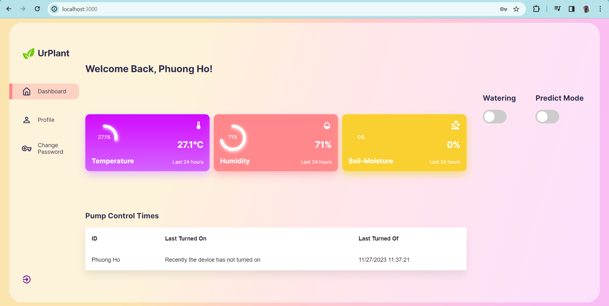
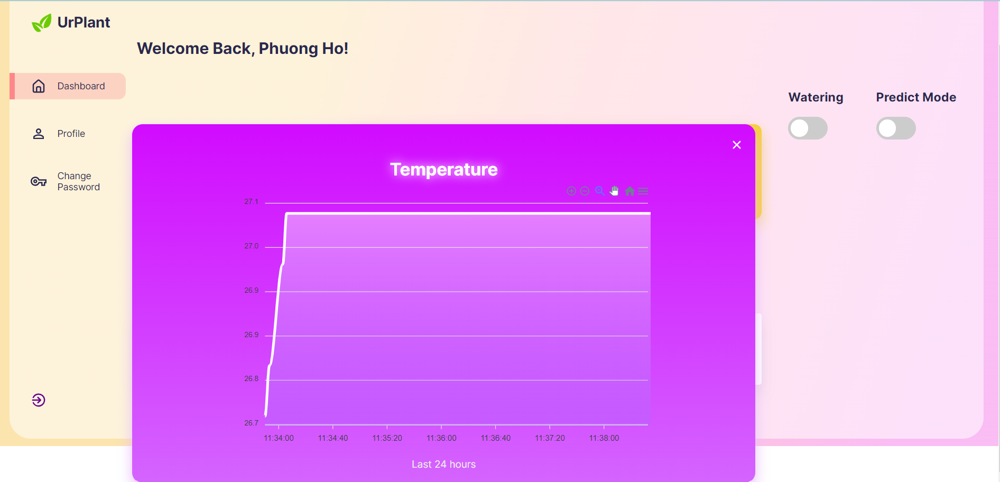
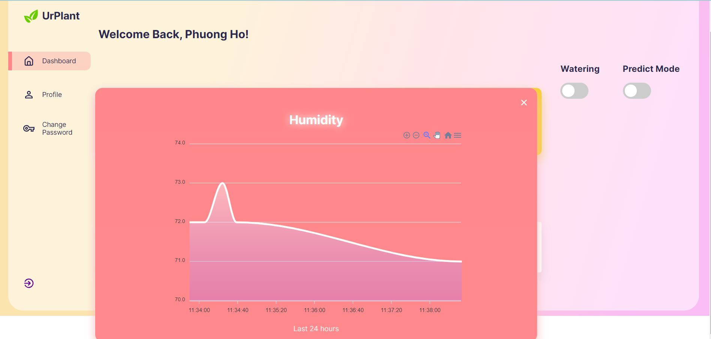
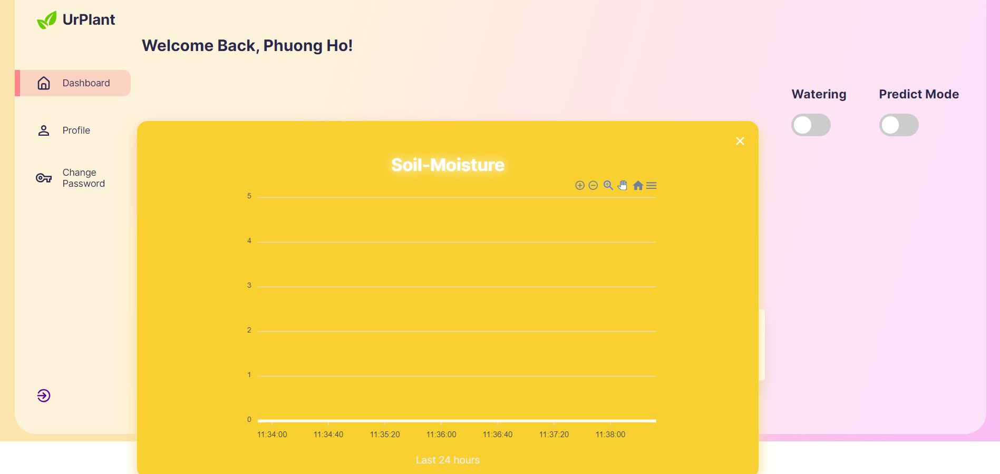
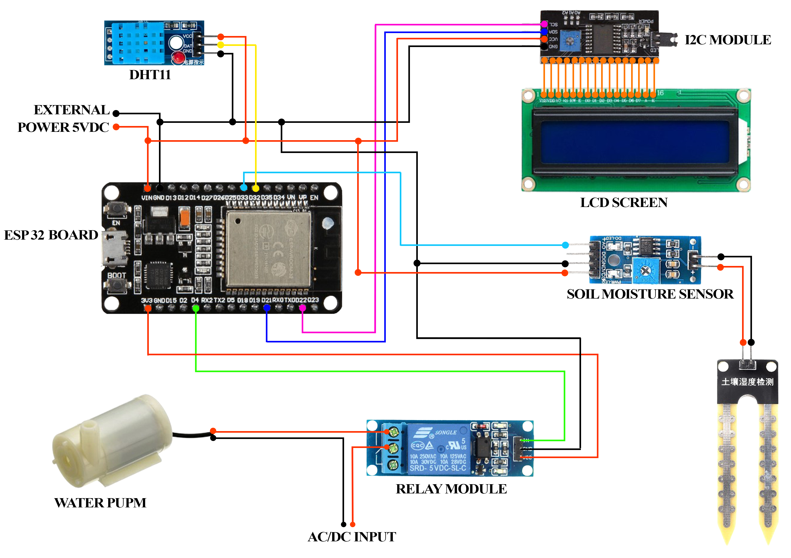

# Smart-Watering-System

A web application to control the watering system online.

Technology used:
* Front-end: ReactJS, React Router v6, Material UI, Apex charts, React Circular Progressbar
* Back-end: Flask-Python
* Database: MongoDB
* IDE for upload code to the Arduino board: Arduino

Features:
* Display temperature, humidity, and soil moisture parameters on the interface.
* Button sends an API to the Arduino to control the pump remotely.
* Predict mode using Fuzzy Logic to send notification to user when to turn on the pump and when to turn off the pump base on three input parameters
* Authentication with Flask-JWT

Screenshots:

Dashboard:

Temperature Detail:

Humidity Detail:

Soil Moisture Detail:

Circuit Board:

